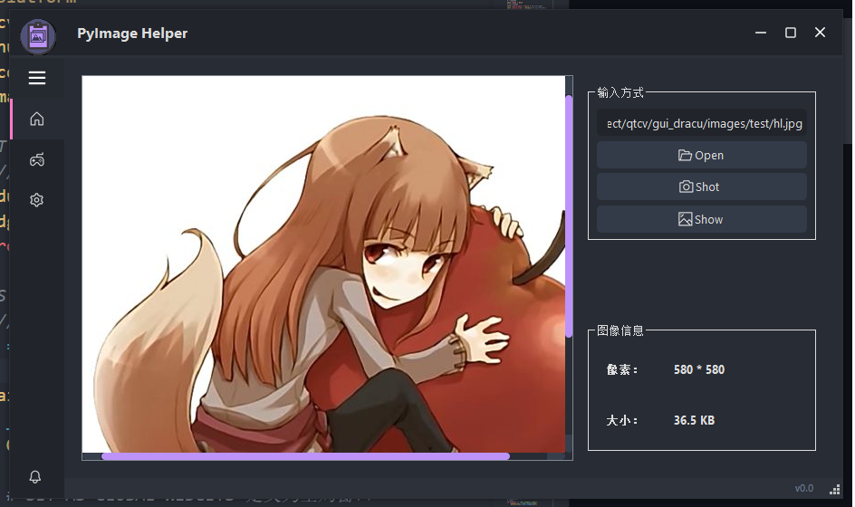
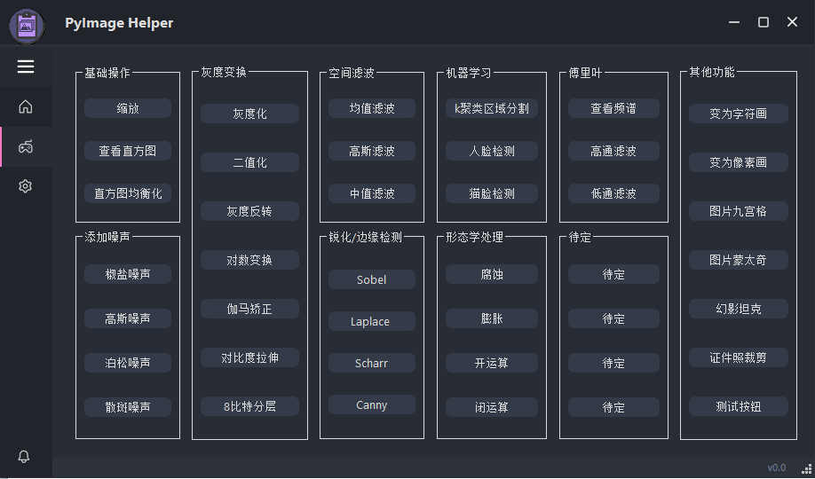
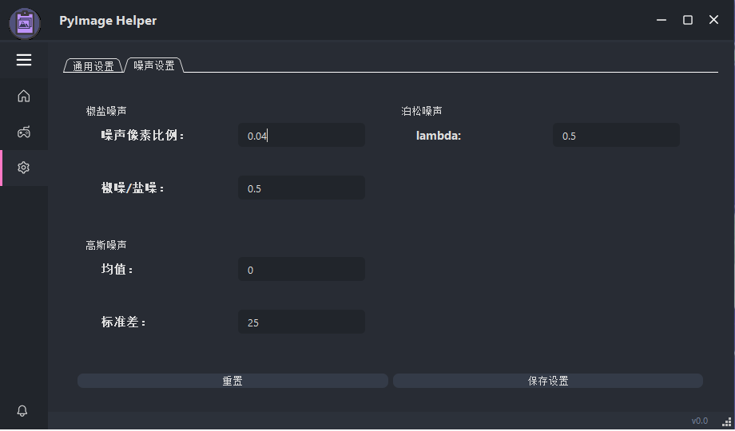
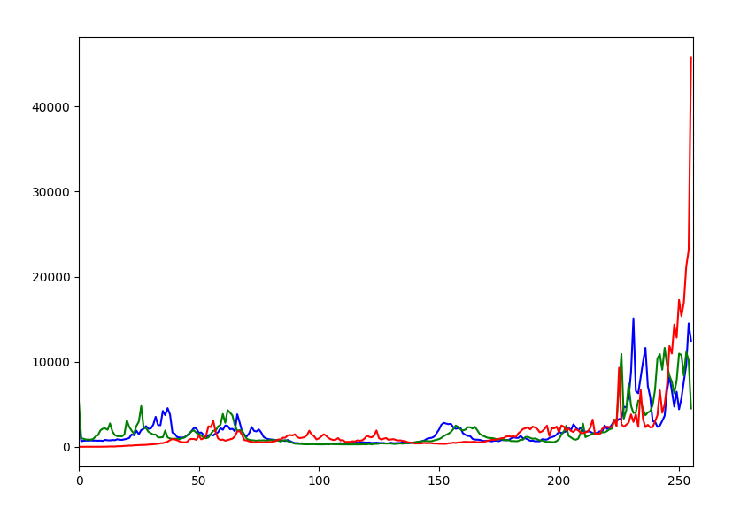
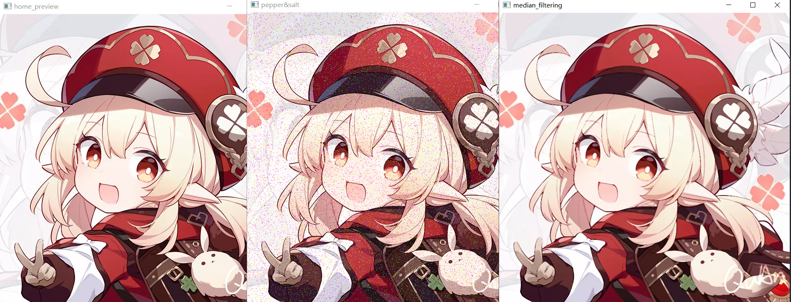
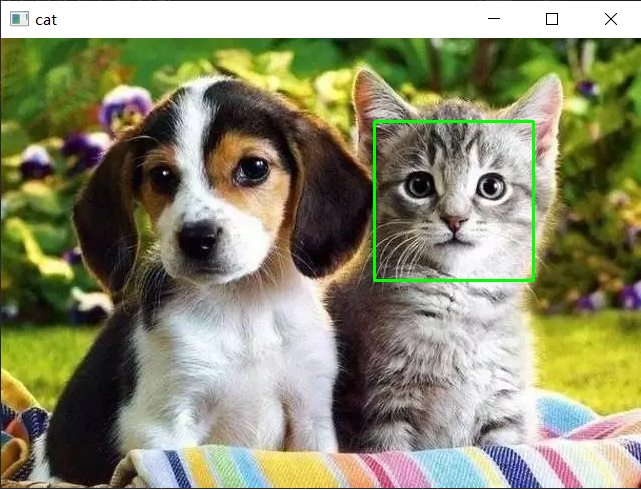

# PyImage helper

## 简介

PyImage helper是一个初学者学习数字图像处理的入门级项目。目的是通过编写项目掌握图像处理的基础处理方法，掌握使用python语言利用pyside6开发小项目，熟悉opencv库的使用。


## 软硬件环境

硬件：PC(win10系统)带摄像头

软件：Anaconda3(python环境配置)、vscode(编辑器)


ui模板采用的是[Modern_GUI_PyDracula_PySide6_or_PyQt6](https://github.com/Wanderson-Magalhaes/Modern_GUI_PyDracula_PySide6_or_PyQt6)

需要的第三方库
```
pip install opencv-python
pip install pyside6
pip install cx-Freeze
pip install matplotlib
```

## 软件展示



主页面用于展示图片信息，三个按钮从上到下分别是从文件中打开图片，打开摄像头/拍摄，展示左侧图片



功能页大部分都是一些非常基础的图像处理的算法**其他功能**项是写的一些小程序


文件路径的设置



噪声设置，主要用于**添加加噪**项


## 部分功能展示

### 彩色图片直方图展示



### 原图，加噪，中值滤波



### 猫脸检测



### 字符画

